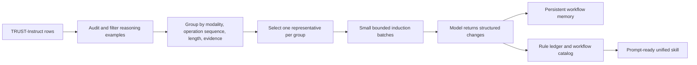

# Multimodal misinformation skill-extraction report

## 1. Unified skill for all detection tasks

### Motivation

Develop a distortion-aware skill extraction framework that improves a
general-purpose agent on multimodal misinformation detection while preserving
the different textual, visual, and cross-modal procedures demonstrated by
TRUST-Instruct.

### Figure



### Input

The input is one bounded batch of TRUST-Instruct trajectory records. Each
record contains the dataset `id`, image reference, human instruction/caption,
and assistant response. The induction sample contains 196 representatives:
40 cross-modal, 71 textual, and 85 visual, with one representative retained
from each of 196 semantic groups.

The originally proposed prompt wording was:

> Given a list of web navigation tasks, extract common workflows ...

For this project it was adapted to multimodal misinformation trajectories:
extract reusable verification operations, ordering, branches, evidence rules,
decision criteria, and output contracts; abstract variable content; avoid
overlap; and return strict compact JSON.

### Induction prompt

```text
Given a list of multimodal misinformation-verification trajectories, extract
the reusable workflows demonstrated by the data. For each trajectory, inspect
the caption, image reference, evidence fields, instruction, and assistant
response. Identify recurrent operations, ordering constraints, conditional
branches, evidence-handling rules, decision criteria, uncertainty, and output
format. Abstract people, claims, dates, locations, URLs, and evidence items
into descriptive variables. Do not use row IDs, filenames, labels, or outside
knowledge as evidence. Do not repeat trajectories. Return strict JSON with a
compact batch observation, at most three candidate changes, structured
workflows, and per-row provenance. Use no_change when the batch adds nothing
supported. Preserve all requested fields: name, purpose, triggers, inputs,
ordered steps, conditions, evidence_rules, decision_criteria,
output_contract, uncertainty, and supporting_row_ids.
```

### Output

The model output is persisted into:

- `working_unified_skill.md`: rendered prompt-ready skill;
- `rule_ledger.json`: deduplicated structured rules with support rows and
  batch provenance;
- `workflow_catalog.json`: deduplicated reusable workflows;
- `workflow_memory.jsonl`: one observation record per processed trajectory;
- `skill_change_log.jsonl`: accepted changes only;
- `progress.json` and per-batch cache files for resumability.

The final consolidated skill is
`artifacts/final_unified_skill.md`.

### Prompt details / implementation

The implementation is under `extraction/unified/`. Its design follows the
agentic workflow-memory pattern: bounded induction batches, persistent state,
cache-first resume, structured updates, and provenance-linked consolidation.
The existing TRUST-VL skill is a downstream reference supplied by the project:
[trust-vl-multimodal-misinformation](https://github.com/jagerknight10/multimodal-misinformation-detection/tree/main/skills/trust-vl-multimodal-misinformation).

## 2. One routing skill and multiple distortion-specific skills

This is the next phase. It was not run during unified induction, as required
by the brief. It should reuse the same stratified TRUST-Instruct input and
persistent-memory loop, but create four separate prompt-ready skills.

### Routing skill

**Input:** image, caption, optional direct/inverse/context evidence, and the
task instruction.

**Output:** a routing decision identifying the applicable specialist(s):
`Check_textual_factuality`, `Check_visual_manipulation`,
`Check_cross_modal_consistency`, or a justified combination, plus the
uncertainty and required evidence fields. The router must not itself invent a
final fact beyond what the input supports.

**Prompt details:** use the repository routing prompt as the starting
interface, then induce and provenance-link its routing criteria from the
corresponding TRUST-Instruct families:
[route-multimodal-misinformation/SKILL.md](https://raw.githubusercontent.com/jagerknight10/multimodal-misinformation-detection/refs/heads/main/skills/route-multimodal-misinformation/SKILL.md).

### Textual specialist: `Check_textual_factuality`

**Input:** caption/text claim, direct and inverse/context evidence, and image
only when it helps disambiguate the textual claim.

**Output:** decomposed textual claim, evidence relevance and support/refutation
findings, uncertainty, and `Real`/`Fake` (or `Insufficient` when the task
allows it).

**Prompt details:** induce only from the 71 textual groups and retain rules
about claim decomposition, source/context support or refutation, attribution,
boilerplate, satire, and insufficient evidence. Do not import the unified
skill's visual-tie rules unless textual examples support them.

### Visual specialist: `Check_visual_manipulation`

**Input:** image, caption as context, and optional evidence about the image.

**Output:** independent image description, manipulation/AI-generation or
medium findings, uncertainty, and a final visual-veracity judgement.

**Prompt details:** induce only from the 85 visual groups. Preserve the
distinction between a genuine image depicting a different event and an image
that is itself manipulated; those are not interchangeable findings.

### Cross-modal specialist: `Check_cross_modal_consistency`

**Input:** image, caption, direct evidence for image checking, and inverse
evidence for text checking.

**Output:** claim elements, image description, image-text consistency,
bidirectional evidence findings, visual-tie/scene-mismatch conditions,
uncertainty, and final `Real`/`Fake` judgement.

**Prompt details:** induce only from the 40 cross-modal groups. The current
unified skill already supplies a validated starting point for this specialist,
but the specialist must receive its own memory, change log, ledger, progress,
and holdout validation artifacts.

## Dataset and extraction status

The audited cached dataset contains 1,409,577 raw rows, 1,409,572 reasoning
examples, and 198,248 target-family misinformation-reasoning examples. It has
160,655 normalized reasoning templates and 173,922 distinct task prompts.
The family counts are visual 129,000, cross-modal 56,126, textual 13,127,
other dedicated 653,196, and generic image 558,128. The full data card is in
`artifacts/data_card.json`; grouping details are in
`artifacts/representatives_sampled/grouping_report.json`.

The sampled unified induction completed 161/161 batches with no failures and
161 model calls. It processed all 196 selected representatives. A separate
semantic holdout evaluation has not yet been run; that is the remaining
validation step before beginning the three specialist passes.
